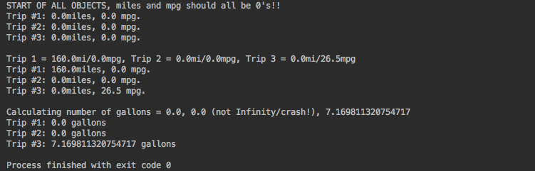

## Odometer Project

Define a class called Odometer that will be used to track fuel and mileage for an automobile. The class should
ONLY have instance variables to track the miles driven and the fuel efficiency of the vehicle in miles per gallon.
Include the following methods only:

<li>toString method (always returns String with all instance variable data inside)</li>
<li>reset the miles driven to 0 miles</li>
<li>set fuel efficiency when given a value in miles per gallon</li>
<li>adds miles to the odometer when given a value for miles driven</li>
<li>get gallons consumed of gasoline returns gallons (gallons = miles / mpg)</li>

